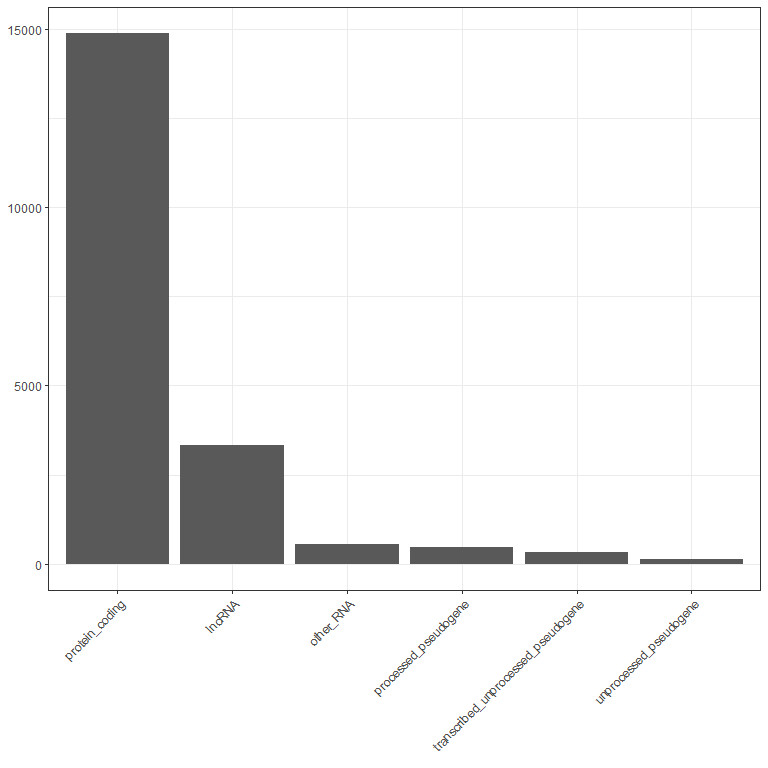
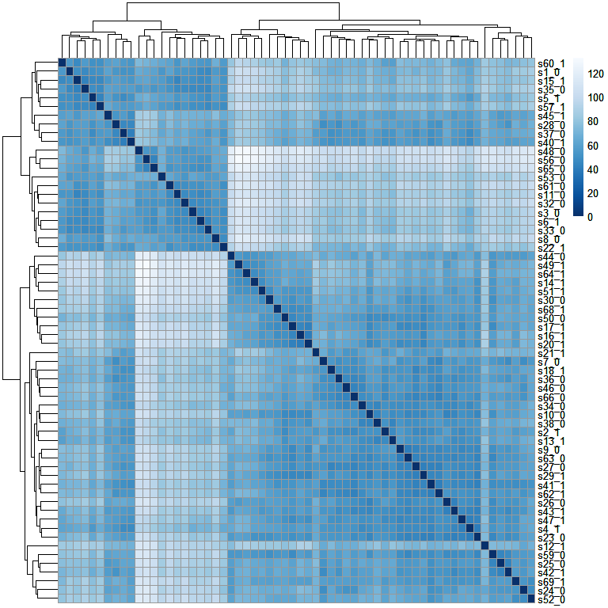
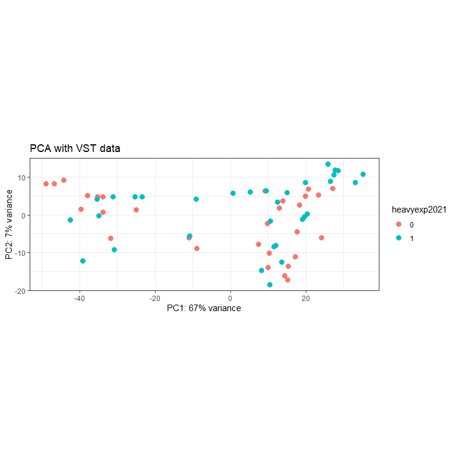
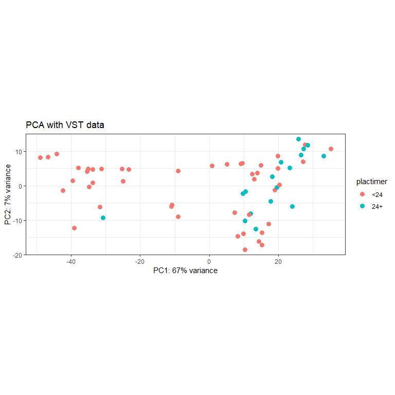
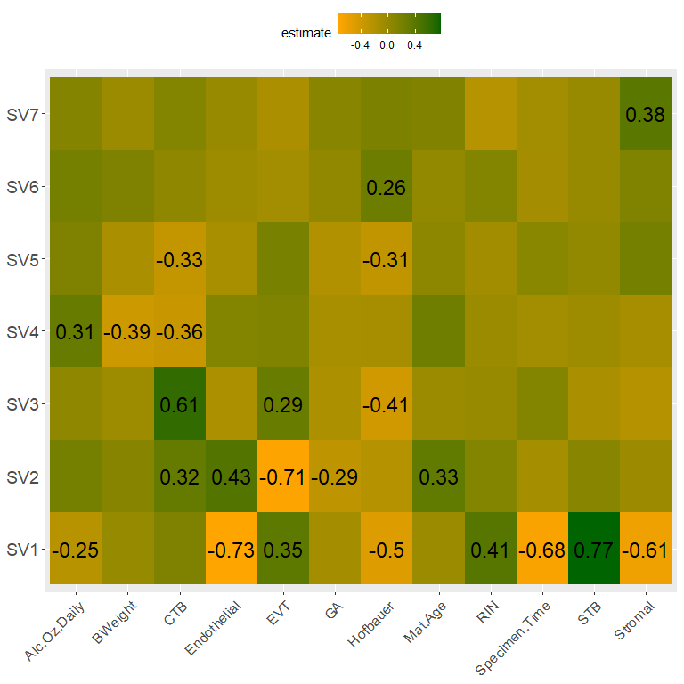
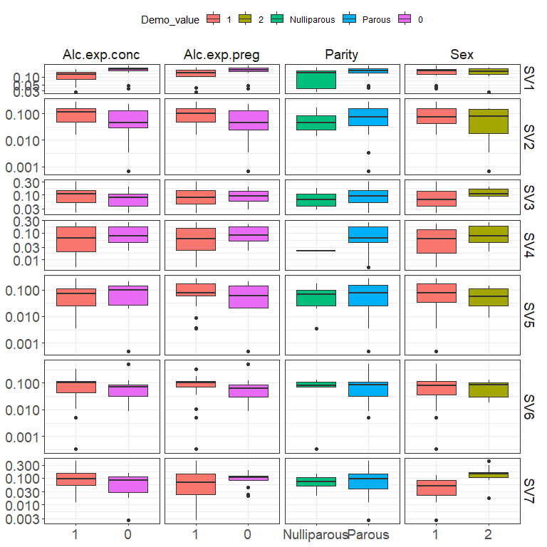
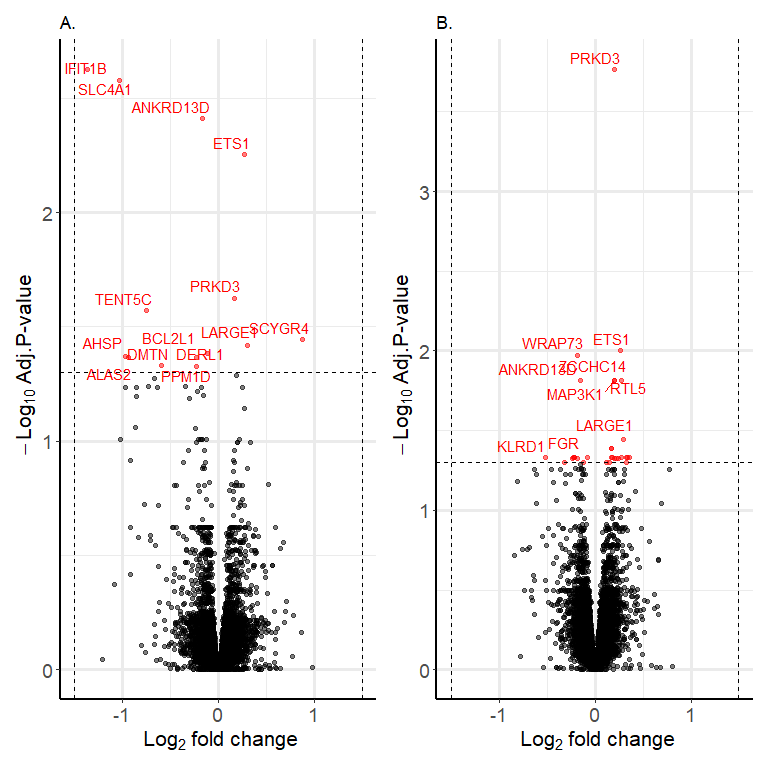
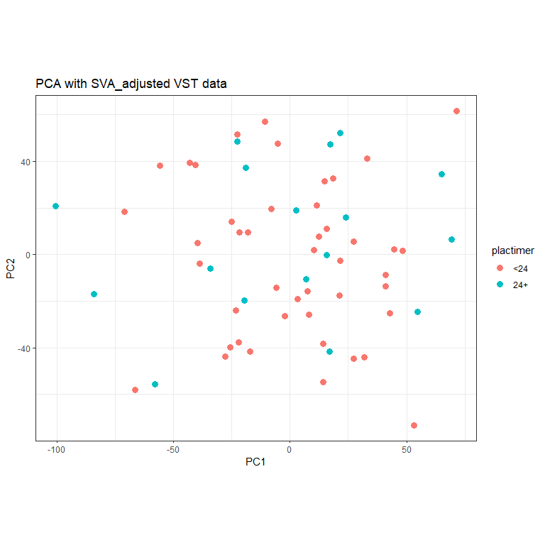

STAR_DESeq2_lowRINrem
================
Maya Deyssenroth
2023-03-31

## R Markdown

This is an R Markdown documenting the DESeq2 workflow using STAR aligned
placental RNAseq data from the Cape Town FASD study. Paired-end stranded
reads (150bp) sequenced at 50M were generated on 72 samples (69 unique
samples and 3 replicates. One sample was dropped due to maternal
contamination. FASTQC was performed. An additional 6 samples with RIN
values 4 and below were removed. Among demographic variables, maternal
age differed by alcohol status. Reads were aligned against the Gencode
GrCh38.v33 using STAR. Mapped genes (60,721) included protein-coding
genes, lncRNA, pseudogenes, etc. Removing genes with 0 counts across all
samples reduced the sample set to 48249 genes. Additional filtering
based on at least 10 reads in a minimum of 50% reduced the sample set to
19632 genes. Finally, restricting to protein-coding genes, the dataset
consists of 14,854 genes. Exploratory data visualizations indicated two
distinct clusters of samples based on PCA and heatmap that partially
disaggregated by RIN/placenta time to collection. Surrogate variable
analysis was performed to identify hidden confounding variables in the
data. Differential gene expression analysis was performed following the
steps outlined in the bioconductor vignette:
<http://bioconductor.org/packages/devel/bioc/vignettes/DESeq2/inst/doc/DESeq2.html>.
Alcohol exposure was modeled as periconceptional and pregnancy-wide
exposure. Additional covariates in the models included 6 cell types, 7
surrogate variables, gestational age, infant sex and maternal age.  
A normalized gene expression dataset with surrogate variables regressed
out from the data was saved as input for WGCNA.

## read in data

## format coldata

``` r
colData<-colData%>%
  filter(!ID==2234)%>% #high maternal contamination
  filter(RIN>4)%>% #remove low RIN samples
  mutate(seqID=paste0("s",sample_id_fastq))%>%
  relocate(seqID,.after=sample_id_fastq)%>%
  mutate(heavyexp2021=factor(heavyexp2021),
         Exp_Concept_YN=factor(Exp_Concept_YN),
         sex_r=factor(sex_r),
         RIN=as.numeric(RIN))%>%
  column_to_rownames(.,var="ID")%>%
  mutate(ID=rownames(.))%>%
  relocate(ID,.before=sample_id_fastq)#62
```

## format cts

``` r
cts<-cts%>%
  dplyr::select(-c("Chr","Start","End","Strand","Length"))%>%
  rename_at(vars(colData$seqID), ~ as.character(row.names(colData)))%>%
  column_to_rownames(.,var="Geneid")
  
cts<-as.matrix(cts)
```

## demographic table

``` r
demo<-colData%>%
  mutate(mograde=ifelse(mograde<10,"<10th grade","at least 10th grade"),
         sex_r=ifelse(sex_r==1,"Male","Female"),
         gravidity_r=ifelse(gravidity_r==0,"Nulliparous","Parous"),
         heavyexp2021=ifelse(heavyexp2021==0,"Unexposed","Exposed"),
         Exp_Concept_YN=ifelse(Exp_Concept_YN==0,"Unexposed","Exposed"))%>%
dplyr::select(moage_t0r,mograde,GA_FINAL_rev,bweight,sex_r,gravidity_r,AADXP_2017,heavyexp2021,Exp_Concept_YN)%>%
tbl_summary(
    by = Exp_Concept_YN,
    statistic = list(all_continuous()  ~ "{mean} ({sd})",
                     all_categorical() ~ "{n}    ({p}%)"),
    digits = list(all_continuous()  ~ c(2, 2),
                  all_categorical() ~ c(0, 1)),
    type = list(GA_FINAL_rev      ~ "continuous",
                bweight ~ "continuous",
                AADXP_2017 ~ "continuous",
                moage_t0r ~ "continuous",
                mograde   ~ "categorical",
                sex_r ~ "categorical",
                gravidity_r ~ "categorical",
                heavyexp2021 ~ "categorical",
                Exp_Concept_YN ~ "categorical"),
    label  = list(GA_FINAL_rev      ~ "Gestational age (weeks)",
                  bweight ~ "Birth weight (grams)",
                  AADXP_2017 ~ "Avg. daily alcohol (oz)",
                  moage_t0r   ~ "Maternal age (years)",
                  mograde ~ "Maternal education (years)",
                  sex_r ~ "Infant sex",
                  gravidity_r ~ "Parity",
                  heavyexp2021 ~ "Alcohol exposed (pregnancy)",
                  Exp_Concept_YN ~ "Alcohol exposed (conception)")
  ) %>%
  add_p(pvalue_fun = ~ style_pvalue(.x, digits = 2)) %>%
  modify_header(label = "**Variable**",
                all_stat_cols() ~ "**{level}**<br>N = {n} ({style_percent(p, digits=1)}%)") %>%
  bold_labels() %>%
  modify_caption("<div style='text-align: left; font-weight: bold;'> Table 1. Participant characteristics by exposure status at conception</div>")

demo%>%
  as_gt()

demo%>%
 as_gt() %>% # convert to gt table
  gt::gtsave( # save table as image
    filename = "../Tables/Table1_conc_lowRINrem.png"
  )
```

## create DESeq dataset

``` r
all(rownames(colData) == colnames(cts))
#FALSE: sequencing data has 72 samples - remove 3 replicates + 1 due to maternal contamination 

cts <- cts[, rownames(colData)] #subset to unique IDs; alternatively could run collapseReplicates command if replicates are known
all(rownames(colData) == colnames(cts)) #TRUE

dds <- DESeqDataSetFromMatrix(countData = cts,
                              colData = colData,
                              design = ~ Stromal + Hoffbauer + EVT + CTB + Endothelial + STB + GA_FINAL_rev + sex_r + moage_t0r+heavyexp2021)
```

## subset to protein-coding genes and remove lowly expressed

``` r
txdb<-import("../../../../Data/RNAseq/STAR/gencode.v33.annotation.gtf.gz", format="gtf")

txdb_biotype<-unique(data.frame(GENEID=mcols(txdb)$gene_id,TXTYPE=mcols(txdb)$gene_type))
txdb_dds<-txdb_biotype[txdb_biotype$GENEID%in%row.names(counts(dds)),] 

#label mRNA species
txdb_dds<-txdb_dds%>%mutate(TXTYPE=factor(ifelse(TXTYPE=="protein_coding","protein_coding",ifelse(TXTYPE=="lncRNA","lncRNA",ifelse(TXTYPE=="processed_pseudogene","processed_pseudogene",ifelse(TXTYPE=="transcribed_unprocessed_pseudogene","transcribed_unprocessed_pseudogene",ifelse(TXTYPE=="unprocessed_pseudogene","unprocessed_pseudogene","other_RNA")))))))

#remove lowly expressed
keep <- rowSums(counts(dds)) > 1
dds <- dds[keep,] #48249
keep <- rowSums(counts(dds) > 10) >= 0.5*(ncol(dds)) 
summary(keep) #19648
dds <- dds[keep,]


#plot detected mRNA species captured in data
txdb_dds_filter<-txdb_dds[txdb_dds$GENEID%in%row.names(counts(dds)),] 

mRNA_profile<-ggplot(txdb_dds_filter, aes(reorder(TXTYPE,TXTYPE,function(x)-length(x))))+
  geom_bar()+
  theme_bw()+
  theme(axis.title=element_blank(),
    axis.text.x=element_text(angle=45,hjust=1,vjust=1))

mRNA_profile
```

<!-- -->

``` r
pdf("lowRINrem/Plots/QC/dds_biotype_filter.pdf")
mRNA_profile
dev.off()

#restrict data to protein-coding 
coding<-txdb_dds$GENEID[txdb_dds$TXTYPE=="protein_coding"]
dds<-dds[row.names(counts(dds)) %in% coding, ] #14866
dds<-DESeq(dds)
```

## Exploratory analysis of sample variability

``` r
#transform for visualization
vsd <- vst(dds, blind = TRUE)

#Sample distance
sampleDists <- dist(t(assay(vsd)))
sampleDistMatrix <- as.matrix( sampleDists )
rownames(sampleDistMatrix) <- paste( vsd$seqID, vsd$Exp_Concept_YN, sep = "_" )
colnames(sampleDistMatrix) <- NULL
colors <- colorRampPalette( rev(brewer.pal(9, "Blues")) )(255)

sample_heatmap<-pheatmap(sampleDistMatrix,
         clustering_distance_rows = sampleDists,
         clustering_distance_cols = sampleDists,
         col = colors)

sample_heatmap
```

<!-- -->

``` r
pdf("lowRINrem/Plots/QC/heatmap.pdf")
sample_heatmap
dev.off()

#PCA
pcaData <- plotPCA(vsd, intgroup = c( "sex_r", "Exp_Concept_YN","heavyexp2021","RIN","plactimer", "GA_FINAL_rev","moage_t0r"), returnData = TRUE)
pcaData<-pcaData%>%
  mutate(RIN=factor(ifelse(RIN>7,"7+","<7")),
         plactimer=factor(ifelse(plactimer>24,"24+","<24")),
         GA_FINAL_rev=factor(ifelse(GA_FINAL_rev<37,"preterm","term")),
         moage_t0r=factor(ifelse(moage_t0r<25,"<25",
                                 ifelse(moage_t0r>35,">35","25-35"))))

percentVar <- round(100 * attr(pcaData, "percentVar"))


PCA_alc_preg<-ggplot(pcaData, aes(x = PC1, y = PC2, color = heavyexp2021)) +
  geom_point(size =3) +
  xlab(paste0("PC1: ", percentVar[1], "% variance")) +
  ylab(paste0("PC2: ", percentVar[2], "% variance")) +
  coord_fixed() +
  theme_bw()+
  #geom_text(data=subset(pcaData, PC1 < -20),vjust=0,hjust=0)+
  ggtitle("PCA with VST data")

PCA_alc_preg
```

<!-- -->

``` r
pdf("lowRINrem/Plots/QC/pca_preg_exposure.pdf")
PCA_alc_preg
dev.off()

pdf("lowRINrem/Plots/QC/pca_conc_exposure.pdf")
ggplot(pcaData, aes(x = PC1, y = PC2, color = Exp_Concept_YN, label = name)) +
  geom_point(size =3) +
  xlab(paste0("PC1: ", percentVar[1], "% variance")) +
  ylab(paste0("PC2: ", percentVar[2], "% variance")) +
  coord_fixed() +
  theme_bw()+
  geom_text(data=subset(pcaData, PC1 < -20),vjust=0,hjust=0)+
  ggtitle("PCA with VST data")
dev.off()

pdf("lowRINrem/Plots/QC/pca_sex.pdf")
ggplot(pcaData, aes(x = PC1, y = PC2, color = factor(sex_r), label = name)) +
  geom_point(size =3) +
  xlab(paste0("PC1: ", percentVar[1], "% variance")) +
  ylab(paste0("PC2: ", percentVar[2], "% variance")) +
  coord_fixed() +
  theme_bw()+
  geom_text(data=subset(pcaData, PC1 < -20),vjust=0,hjust=0)+
  ggtitle("PCA with VST data")
dev.off()

pdf("lowRINrem/Plots/QC/pca_RIN.pdf")
ggplot(pcaData, aes(x = PC1, y = PC2, color = RIN, label = name)) +
  geom_point(size =3) +
  xlab(paste0("PC1: ", percentVar[1], "% variance")) +
  ylab(paste0("PC2: ", percentVar[2], "% variance")) +
  coord_fixed() +
  theme_bw()+
  geom_text(data=subset(pcaData, PC1 < -20),vjust=0,hjust=0)+
  ggtitle("PCA with VST data")
dev.off()

PCA_plactime<-ggplot(pcaData, aes(x = PC1, y = PC2, color = plactimer)) +
  geom_point(size =3) +
  xlab(paste0("PC1: ", percentVar[1], "% variance")) +
  ylab(paste0("PC2: ", percentVar[2], "% variance")) +
  coord_fixed() +
  theme_bw()+
  #geom_text(data=subset(pcaData, PC1 < -20),vjust=0,hjust=0)+
  ggtitle("PCA with VST data")

PCA_plactime
```

<!-- -->

``` r
pdf("lowRINrem/Plots/QC/pca_plactimer.pdf")
PCA_plactime
dev.off()
```

## variance partition of original dataset

``` r
var.demo<-demo%>%
  dplyr::select(RIN,Gest.Age,Mat.Age,Specimen.Time,BWeight,Stromal,Hofbauer,EVT,CTB,STB,Endothelial,Alc.Exposed.Preg,Alc.Exposed.Conc,Sex,Parity,Mat.Edu)%>%
  mutate_at(c('RIN','Gest.Age',"Mat.Age",'Specimen.Time','BWeight','Stromal','Hofbauer','EVT','CTB','STB','Endothelial'),~(scale(.) %>% as.vector))
  
dat  <- counts(dds, normalized = TRUE)
idx  <- rowMeans(dat) > 1 #all TRUE
dat  <- dat[idx, ]

form <- ~ RIN + Gest.Age+Mat.Age+Specimen.Time+BWeight+Stromal+Hofbauer+EVT+CTB+STB+Endothelial+(1|Alc.Exposed.Preg) + (1|Alc.Exposed.Conc)+ (1|Sex) + (1|Parity) +(1|Mat.Edu)

varPart <- fitExtractVarPartModel(dat, form, var.demo )
vp <- sortCols( varPart )

#plotPercentBars( vp[1:10,] )

plotVarPart(v )

pdf("lowRINrem/Plots/QC/variancePartition.pdf")
plotVarPart( vp )
dev.off()
```

## match hgnc symbols to available ensembl IDs

``` r
dds_ensembl<-gsub("\\..*", "", rownames(dds))   

ensembl = useMart("ensembl",dataset="hsapiens_gene_ensembl")
mapping <- getBM(attributes=c("hgnc_symbol","ensembl_gene_id"), filters = "ensembl_gene_id", mart=ensembl, values=dds_ensembl)

gene_symbol_mapping<-mapping%>%
  group_by(ensembl_gene_id)%>%
  mutate(name_total=paste(hgnc_symbol,collapse=";"))%>%
  mutate(name_total=na_if(name_total,""),
         name_total=ifelse(is.na(name_total),ensembl_gene_id,name_total))%>%
  distinct()
```

## conduct surrogate variable analysis

``` r
dat  <- getVarianceStabilizedData(dds)
idx  <- rowMeans(dat) > 1 #all
dat  <- dat[idx, ]
mod <- model.matrix(~heavyexp2021,colData(dds))
mod0 <- model.matrix(~   1, colData(dds))

n.sv <- num.sv(dat,mod,method="be") #7
svseq <- svaseq(dat, mod, mod0, n.sv = 7)

ddssva <- dds
ddssva$SV1 <- svseq$sv[,1]
ddssva$SV2 <- svseq$sv[,2]
ddssva$SV3 <- svseq$sv[,3]
ddssva$SV4 <- svseq$sv[,4]
ddssva$SV5 <- svseq$sv[,5]
ddssva$SV6 <- svseq$sv[,6]
ddssva$SV7 <- svseq$sv[,7]

## save SV data
SVs=svseq$sv
colnames(SVs) <- paste0("STAR_SV",seq(1:7))
rownames(SVs)<-colData$SampleID_DNA_from_Qian
write.csv(SVs,"../../../../Data/Covariates/STAR_SVs_lowRINrem.csv")


## check SV relationship with known covariates

SV_data<-cbind(colData,SVs)
SV_corr<-SV_data%>%
  dplyr::select(seqID,RIN,plactimer,GA_FINAL_rev,bweight,moage_t0r,Stromal,Hoffbauer,EVT,CTB,STB,Endothelial,AADXP_2017,starts_with(("STAR")))%>%
  pivot_longer(!c(seqID,starts_with("STAR")),names_to="Demo",values_to="Demo_value")%>%
  pivot_longer(!c(seqID,Demo,Demo_value),names_to="SV",values_to="SV_value")%>%
  mutate(group=paste(Demo,SV,sep="_"))%>%
  nest(data = -group) %>% 
  mutate(
    test = map(data, ~ cor.test(.x$Demo_value,.x$SV_value, method="spearman")),
    tidied = map(test, tidy)
  ) %>% 
  unnest(tidied)

SV_corr<-SV_corr%>%
  dplyr::select(group,estimate,p.value)%>%
  mutate(Demo=str_split_i(group,"_",1),
         SV=str_split_i(group,"_",-1))


SV_heatmap<-SV_corr %>% 
  mutate(Demo=ifelse(Demo=="GA_FINAL_rev","GestAge",
                     ifelse(Demo=="plactimer","Specimen.Time",
                            ifelse(Demo=="bweight","BWeight",
                                   ifelse(Demo=="moage","Mat.Age",
                                          ifelse(Demo=="Hoffbauer","Hofbauer",
                                                ifelse(Demo=="AADXP","Alc.Oz.Daily",Demo)))))))%>%
  ggplot(aes(Demo, SV, fill = estimate, label="estimate")) +
  geom_tile() +
  scale_fill_gradient(low="orange",high="darkgreen") +
  geom_text(aes(label=ifelse(p.value>0.05,"",round(estimate,2))),size=6)+
  theme(axis.title=element_blank(),
        axis.text.x=element_text(size=12,angle=45,hjust=1,vjust=1),
        axis.text.y=element_text(size=14),
        legend.position = 'top')

SV_heatmap
```

<!-- -->

``` r
pdf("lowRINrem/Plots/QC/SV_demo_cont.pdf")
SV_heatmap
dev.off()


SV_ttest<-SV_data%>%
  dplyr::select(seqID,sex_r, gravidity_r,heavyexp2021,Exp_Concept_YN,starts_with(("STAR")))%>%
  mutate(Sex=factor(sex_r),
         gravidity_r=factor(ifelse(gravidity_r==0,"Nulliparous","Parous")),
         heavyexp2021=factor(heavyexp2021),
         Exp_Concept_YN=factor(Exp_Concept_YN))%>%
  pivot_longer(!c(seqID,starts_with("STAR")),names_to="Demo",values_to="Demo_value")%>%
  pivot_longer(!c(seqID,Demo,Demo_value),names_to="SV",values_to="SV_value")%>%
  mutate(group=paste(Demo,SV,sep="_"))%>%
  nest(data = -group) %>% 
  mutate(
    test = map(data, ~ t.test(SV_value ~ Demo_value, data = .x)),
    tidied = map(test, tidy)
  ) %>% 
  unnest(tidied)


SV_cat_boxplot<-SV_data%>%
  dplyr::select(seqID,sex_r, gravidity_r,heavyexp2021,Exp_Concept_YN, starts_with(("STAR")))%>%
  dplyr::rename(Parity=gravidity_r,Alc.exp.preg=heavyexp2021,Alc.exp.conc=Exp_Concept_YN,Sex=sex_r)%>%
  dplyr::rename_with(~str_remove(.,'STAR_'))%>%
  mutate(Sex=factor(Sex),
         Parity=factor(ifelse(Parity==0,"Nulliparous","Parous")),
         Alc.exp.preg=factor(Alc.exp.preg),
         Alc.exp.conc=factor(Alc.exp.conc))%>%
  pivot_longer(!c(seqID,starts_with("SV")),names_to="Demo",values_to="Demo_value")%>%
  pivot_longer(!c(seqID,Demo,Demo_value),names_to="SV",values_to="SV_value")%>%
  mutate(group=paste(Demo,SV,sep="_"))%>%
  ggplot(.,aes(x=Demo_value, y=SV_value,fill=Demo_value))+
  geom_boxplot() +
  scale_y_log10()+
  theme_bw()+
  theme(axis.title=element_blank(),
        axis.text=element_text(size=14),
        legend.position = 'top',
        strip.background = element_blank(),
        strip.text = element_text(size = 14))+
  facet_grid(SV~Demo,space="free",scales='free')

SV_cat_boxplot
```

<!-- -->

``` r
pdf("lowRINrem/Plots/QC/SV_demo_cat.pdf")
SV_cat_boxplot
dev.off()
```

## conduct differential gene expression analysis including surrogate variables, demographic variables, and cell type as covariates

``` r
## pregnancy-wide DEGs adjusted for SVs and demographic variables (no cell type)
design(ddssva) <- ~ SV1 + SV2 + SV3 + SV4 +SV5 + SV6 + SV7 +  GA_FINAL_rev + sex_r + moage_t0r + heavyexp2021

ddssva<-DESeq(ddssva)

res <- results(ddssva,contrast=c("heavyexp2021","1","0"))
res<-res[order(res$pvalue),]
res
summary(res)
sum(res$padj < 0.05, na.rm=TRUE) #1

res<-as.data.frame(res)

res<-res%>%
  rownames_to_column(var="ensembl_gene_id")%>%
  mutate(ensembl_gene_id=str_remove(ensembl_gene_id,"\\..*"))%>%
  left_join(gene_symbol_mapping)%>%
  distinct()

## volcano plot
res_volcano_05<-res%>%
  mutate(sig=factor(ifelse(padj < 0.05,"sig","not.sig")))%>%
  drop_na(padj)%>%
  ggplot(aes(x=log2FoldChange, y=-log10(padj), colour=sig,label=hgnc_symbol))+
  geom_point(alpha=0.5) +
  scale_color_manual(values=c("black", "red")) +
  geom_text_repel(aes(label=ifelse(padj<0.05,as.character(hgnc_symbol),"")),max.overlaps=20)+
  geom_hline(yintercept=-log10(0.05), linetype="dashed") +
  geom_vline(xintercept=c(-1.5, 1.5), linetype="dashed") +
  labs(x=bquote(~Log[2] ~ "fold change"),y=bquote(~-Log[10] ~ "Adj.P-value"),title="Pregnancy-wide DEGs adjusted for SVs and demographic variables")+
  theme_bw()+
  theme(panel.border = element_blank(),
        axis.line = element_line(color = 'black',size=1),
        panel.grid.major = element_line(linewidth = (1.2)),
        panel.grid.minor=element_line(),
        axis.title=element_text(size=14,face="bold"),
        axis.text=element_text(size=12),
        legend.position = "none")

pdf("lowRINrem/Plots/volcano_preg_demo_SV_adj_05.pdf")
res_volcano_05
dev.off()

saveRDS(res,"lowRINrem/res_preg_demo_SVs_adj.rds")


## pregnancy-wide DEGs adjusted for SVs, demographic variables, and cell type
design(ddssva) <- ~ SV1 + SV2 + SV3 + SV4 +SV5 + SV6 + SV7 +  GA_FINAL_rev + sex_r + moage_t0r + EVT + CTB + Stromal + Hoffbauer + Endothelial + STB + heavyexp2021

ddssva<-DESeq(ddssva)

res <- results(ddssva,contrast=c("heavyexp2021","1","0"))
res<-res[order(res$pvalue),]
res
summary(res)
sum(res$padj < 0.05, na.rm=TRUE) #31

res<-as.data.frame(res)

res<-res%>%
  rownames_to_column(var="ensembl_gene_id")%>%
  mutate(ensembl_gene_id=str_remove(ensembl_gene_id,"\\..*"))%>%
  left_join(gene_symbol_mapping)%>%
  distinct()

## volcano plot
res_volcano_05<-res%>%
  mutate(sig=factor(ifelse(padj < 0.05,"sig","not.sig")))%>%
  drop_na(padj)%>%
  ggplot(aes(x=log2FoldChange, y=-log10(padj), colour=sig,label=hgnc_symbol))+
  geom_point(alpha=0.5) +
  scale_color_manual(values=c("black", "red")) +
  geom_text_repel(aes(label=ifelse(padj<0.05,as.character(hgnc_symbol),""),hjust=1,vjust=1),max.overlaps = 25)+
  geom_hline(yintercept=-log10(0.05), linetype="dashed") +
  geom_vline(xintercept=c(-1.5, 1.5), linetype="dashed") +
  labs(x=bquote(~Log[2] ~ "fold change"),y=bquote(~-Log[10] ~ "Adj.P-value"), title="Pregnancy-wide DEGs adjusted for SVs, demographic variables and cell type")+
  theme_bw()+
  theme(panel.border = element_blank(),
        axis.line = element_line(color = 'black',linewidth =1),
        panel.grid.major = element_line(linewidth = (1.2)),
        panel.grid.minor=element_line(),
        axis.title=element_text(size=16,face="bold"),
        axis.text=element_text(size=14),
        legend.position = "none")

pdf("lowRINrem/Plots/volcano_preg_demo_cell_SV_adj_05.pdf")
res_volcano_05
dev.off()

saveRDS(res,"lowRINrem/output/res_preg_demo_cell_SVs_adj.rds")


## periconceptional DEGs adjusted for SVs and demographic variables (no cell type)
design(ddssva) <- ~ SV1 + SV2 + SV3 + SV4 +SV5 + SV6 + SV7 + GA_FINAL_rev + sex_r + moage_t0r + Exp_Concept_YN

ddssva<-DESeq(ddssva)

res <- results(ddssva,contrast=c("Exp_Concept_YN","1","0"))
res<-res[order(res$pvalue),]
res
summary(res)
sum(res$padj < 0.05, na.rm=TRUE) #0

res<-as.data.frame(res)

res<-res%>%
  rownames_to_column(var="ensembl_gene_id")%>%
  mutate(ensembl_gene_id=str_remove(ensembl_gene_id,"\\..*"))%>%
  left_join(gene_symbol_mapping)%>%
  distinct()

## volcano plot
res_volcano_05<-res%>%
  mutate(sig=factor(ifelse(padj < 0.05,"sig","not.sig")))%>%
  drop_na(padj)%>%
  ggplot(aes(x=log2FoldChange, y=-log10(padj), colour=sig,label=hgnc_symbol))+
  geom_point(alpha=0.5) +
  scale_color_manual(values=c("black", "red")) +
  geom_text_repel(aes(label=ifelse(padj<0.05,as.character(hgnc_symbol),"")),max.overlaps=20)+
  geom_hline(yintercept=-log10(0.05), linetype="dashed") +
  geom_vline(xintercept=c(-1.5, 1.5), linetype="dashed") +
  labs(x=bquote(~Log[2] ~ "fold change"),y=bquote(~-Log[10] ~ "Adj.P-value"), title="Periconceptional DEGs adjusted for SVs and demographic variables")+
  theme_bw()+
  theme(panel.border = element_blank(),
        axis.line = element_line(color = 'black',size=1),
        panel.grid.major = element_line(linewidth = (1.2)),
        panel.grid.minor=element_line(),
        axis.title=element_text(size=14,face="bold"),
        axis.text=element_text(size=12),
        legend.position = "none")

pdf("lowRINrem/Plots/volcano_conc_demo_SV_adj_05.pdf")
res_volcano_05
dev.off()

saveRDS(res,"lowRINrem/output/res_conc_demo_SVs_adj.rds")


## periconceptional DEGs adjusted for SVs, demographic variables, and cell type
design(ddssva) <- ~ SV1 + SV2 + SV3 + SV4 +SV5 + SV6 + SV7 + GA_FINAL_rev + sex_r + moage_t0r + EVT + CTB + Stromal + Hoffbauer + Endothelial + STB + Exp_Concept_YN

ddssva<-DESeq(ddssva)

res <- results(ddssva,contrast=c("Exp_Concept_YN","1","0"))
res<-res[order(res$pvalue),]
res
summary(res)
sum(res$padj < 0.05, na.rm=TRUE) #17

res<-as.data.frame(res)

res<-res%>%
  rownames_to_column(var="ensembl_gene_id")%>%
  mutate(ensembl_gene_id=str_remove(ensembl_gene_id,"\\..*"))%>%
  left_join(gene_symbol_mapping)%>%
  distinct()

## volcano plot
res_volcano_05<-res%>%
  mutate(sig=factor(ifelse(padj < 0.05,"sig","not.sig")))%>%
  drop_na(padj)%>%
  ggplot(aes(x=log2FoldChange, y=-log10(padj), colour=sig,label=hgnc_symbol))+
  geom_point(alpha=0.5) +
  scale_color_manual(values=c("black", "red")) +
  geom_text_repel(aes(label=ifelse(padj<0.05,as.character(hgnc_symbol),""),hjust=1,vjust=1),max.overlaps=15)+
  geom_hline(yintercept=-log10(0.05), linetype="dashed") +
  geom_vline(xintercept=c(-1.5, 1.5), linetype="dashed") +
  labs(x=bquote(~Log[2] ~ "fold change"),y=bquote(~-Log[10] ~ "Adj.P-value"), title="Periconceptional DEGs adjusted for SVs, demographic variables, and cell type")+
  theme_bw()+
  theme(panel.border = element_blank(),
        axis.line = element_line(color = 'black',size=1),
        panel.grid.major = element_line(linewidth = (1.2)),
        panel.grid.minor=element_line(),
        axis.title=element_text(size=16,face="bold"),
        axis.text=element_text(size=14),
        legend.position = "none")

pdf("lowRINrem/Plots/volcano_conc_demo_cell_SV_adj_05.pdf")
res_volcano_05
dev.off()

saveRDS(res,"lowRINrem/output/res_conc_demo_cell_SVs_adj.rds")
```

## panel DEG volcano plots

``` r
res_conc<-readRDS("lowRINrem/output/res_conc_demo_cell_SVs_adj.rds")
res_preg<-readRDS("lowRINrem/output/res_preg_demo_cell_SVs_adj.rds")

volcano_conc<-res_conc%>%
  mutate(sig=factor(ifelse(padj < 0.05,"sig","not.sig")))%>%
  drop_na(padj)%>%
  ggplot(aes(x=log2FoldChange, y=-log10(padj), colour=sig,label=hgnc_symbol))+
  geom_point(alpha=0.5) +
  scale_color_manual(values=c("black", "red")) +
  geom_text_repel(aes(label=ifelse(padj<0.05,as.character(hgnc_symbol),""),hjust=1,vjust=1),max.overlaps = 25)+
  geom_hline(yintercept=-log10(0.05), linetype="dashed") +
  geom_vline(xintercept=c(-1.5, 1.5), linetype="dashed") +
  labs(x=bquote(~Log[2] ~ "fold change"),y=bquote(~-Log[10] ~ "Adj.P-value"))+
  theme_bw()+
  theme(panel.border = element_blank(),
        axis.line = element_line(color = 'black',linewidth =1),
        panel.grid.major = element_line(linewidth = (1.2)),
        panel.grid.minor=element_line(),
        axis.title=element_text(size=16,face="bold"),
        axis.text=element_text(size=14),
        legend.position = "none")+
   ggtitle('A.')

volcano_preg<-res_preg%>%
  mutate(sig=factor(ifelse(padj < 0.05,"sig","not.sig")))%>%
  drop_na(padj)%>%
  ggplot(aes(x=log2FoldChange, y=-log10(padj), colour=sig,label=hgnc_symbol))+
  geom_point(alpha=0.5) +
  scale_color_manual(values=c("black", "red")) +
  geom_text_repel(aes(label=ifelse(padj<0.05,as.character(hgnc_symbol),""),hjust=1,vjust=1),max.overlaps = 25)+
  geom_hline(yintercept=-log10(0.05), linetype="dashed") +
  geom_vline(xintercept=c(-1.5, 1.5), linetype="dashed") +
  labs(x=bquote(~Log[2] ~ "fold change"),y=bquote(~-Log[10] ~ "Adj.P-value"))+
  theme_bw()+
  theme(panel.border = element_blank(),
        axis.line = element_line(color = 'black',linewidth =1),
        panel.grid.major = element_line(linewidth = (1.2)),
        panel.grid.minor=element_line(),
        axis.title=element_text(size=16,face="bold"),
        axis.text=element_text(size=14),
        legend.position = "none")+
  ggtitle('B.')

volcano_conc + volcano_preg + plot_layout(ncol=2,width=c(1.5,1.5))
```

<!-- -->

``` r
pdf("lowRINrem/Plots/volcano_conc_preg_demo_cell_SV_adj_05_multi.pdf",width=12)
volcano_conc + volcano_preg + plot_layout(ncol=2,width=c(1.5,1.5))
dev.off()
```

## overlap in DESeq2 hits

## regress out latent variables from dataset for WGCNA and check PCA for sample distribution

``` r
q_normalize <- function(dat){
  n = nrow(dat)
  p = ncol(dat)
  rank.dat =  dat # matrix for ranking
  for (i in 1:p){
    rank.dat[,i] = rank(dat[,i])
  }
  U = rank.dat/(n+1)
  qnorm(U)
}

dat_vsd<-getVarianceStabilizedData(dds)
idx  <- rowMeans(dat_vsd) > 1 #all TRUE
dat_vsd  <- dat_vsd[idx, ]

mod  <- matrix(1,nrow=dim(t(dat_vsd))[1],ncol=1)
colnames(mod)="Intercept"
nsv=num.sv(dat_vsd,mod,method='be')#8

dat_sva_corrected = sva_network(t(dat_vsd), nsv) #regress out top PCs
dat_sva_corrected<- q_normalize(dat_sva_corrected)
dat_sva_corrected<-t(dat_sva_corrected)

# Check PCA of SV-corrected data

pcaData<-as.data.frame(t(dat_sva_corrected))
#identify features with 0 variance
which(apply(pcaData,2,var)==0)
#None
#drop non-varying
pcaData<-pcaData[,which(!apply(pcaData,2,var)==0)]
pcaData<-prcomp(pcaData,scale=TRUE)
  
pca_scores <- data.frame(ID=dds$ID,RIN=dds$RIN,Sex=dds$sex_r,plactimer=dds$plactimer,gestationalage=dds$GA_FINAL_rev,moage_t0r=dds$moage_t0r,alc.exp.preg=dds$heavyexp2021,alc.exp.conc=dds$Exp_Concept_YN,pcaData$x[,1:3])

pca_scores<-pca_scores%>%
  mutate(RIN=factor(ifelse(RIN>7,"7+","<7")),
         plactimer=factor(ifelse(plactimer>24,"24+","<24")),
         gestationalage=factor(ifelse(gestationalage<37,"preterm","term")),
         moage_t0r=factor(ifelse(moage_t0r<25,"<25",
                                 ifelse(moage_t0r>35,">35","25-35"))))

#percentVar <- round(100 * attr(pcaData, "percentVar"))


pdf("lowRINrem/Plots/QC/pca_preg_exposure_sva.pdf")
ggplot(pca_scores, aes(x = PC1, y = PC2, color = alc.exp.preg, label = ID)) +
  geom_point(size = 3) +
  #xlab(paste0("PC1: ", percentVar[1], "% variance")) +
  #ylab(paste0("PC2: ", percentVar[2], "% variance")) +
  coord_fixed() +
  theme_bw()+
  #geom_text(data=subset(pca_scores, PC1 < -80),vjust=0,hjust=0)+
  ggtitle("PCA with SVA_adjusted VST data")
dev.off()

pdf("lowRINrem/Plots/QC/pca_sex_sva.pdf")
ggplot(pca_scores, aes(x = PC1, y = PC2, color = factor(Sex), label = ID)) +
  geom_point(size =3) +
  #xlab(paste0("PC1: ", percentVar[1], "% variance")) +
  #ylab(paste0("PC2: ", percentVar[2], "% variance")) +
  coord_fixed() +
  theme_bw()+
  #geom_text(data=subset(pca_scores, PC1 < -80),vjust=0,hjust=0)+
  ggtitle("PCA with SVA_adjusted VST data")
dev.off()

pdf("lowRINrem/Plots/QC/pca_RIN_sva.pdf")
ggplot(pca_scores, aes(x = PC1, y = PC2, color = RIN, label = ID)) +
  geom_point(size =3) +
  #xlab(paste0("PC1: ", percentVar[1], "% variance")) +
  #ylab(paste0("PC2: ", percentVar[2], "% variance")) +
  coord_fixed() +
  theme_bw()+
  #geom_text(data=subset(pca_scores, PC1 < -80),vjust=0,hjust=0)+
  ggtitle("PCA with SVA_adjusted VST data")
dev.off()


PCA_plactimer<-ggplot(pca_scores, aes(x = PC1, y = PC2, color = plactimer, label = ID)) +
  geom_point(size =3) +
  #xlab(paste0("PC1: ", percentVar[1], "% variance")) +
  #ylab(paste0("PC2: ", percentVar[2], "% variance")) +
  coord_fixed() +
  theme_bw()+
  #geom_text(data=subset(pca_scores, PC1 < -80),vjust=0,hjust=0)+
  ggtitle("PCA with SVA_adjusted VST data")

PCA_plactimer
```

<!-- -->

``` r
pdf("lowRINrem/Plots/QC/pca_plactimer_sva.pdf")
PCA_plactimer
dev.off()
```

## variance partition of SV-adjusted data

``` r
## check variability in data accounted by cell type and other covariates
form <- ~ RIN + Gest.Age+Mat.Age+Specimen.Time+BWeight+Stromal+Hofbauer+EVT+CTB+STB+Endothelial+(1|Alc.Exposed.Preg) + (1|Alc.Exposed.Conc)+ (1|Sex) + (1|Parity) +(1|Mat.Edu)

varPart <- fitExtractVarPartModel(dat_sva_corrected, form, var.demo )
vp <- sortCols( varPart )

#plotPercentBars( vp[1:10,] )

plotVarPart(vp)

pdf("lowRINrem/Plots/QC/variancePartition_sva.pdf")
plotVarPart( vp )
dev.off()
```

## save normalized datasets

``` r
saveRDS(vsd,"../normalized_data/vsd_lowRINrem.rds")
saveRDS(dat_sva_corrected,"../normalized_data/vsd_sva_lowRINrem.rds")
```
