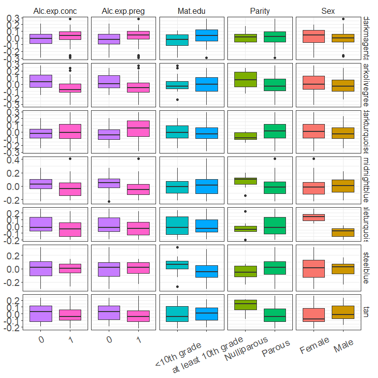
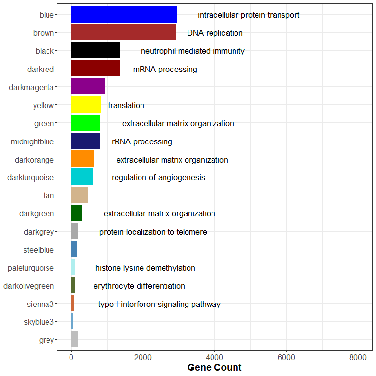
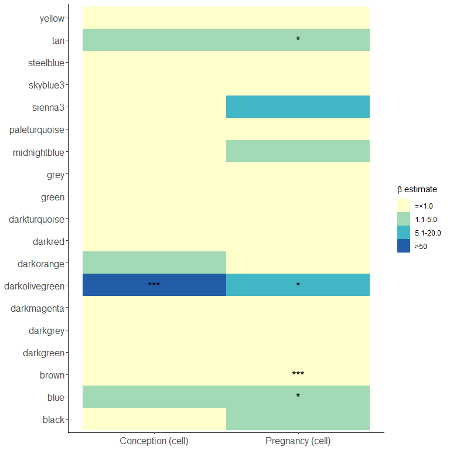
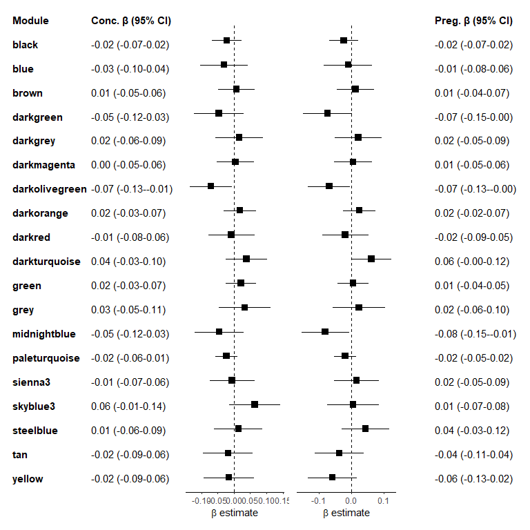

STAR_WGCNA_lowRINrem_sva
================
Maya Deyssenroth
2023-04-07

This is an RMarkdown documenting the WGCNA network analysis for the FASD
study, excluding samples with RIN values 4 and below (n=62). An unsigned
network was generated at power 6 (R^2 = 0.94). A network with 37 modules
was generated, and 197 genes fell into the unmapped grey module. Modules
with correlation \> 0.45 were merged to generate a final network with 19
modules. Modules were correlated with continuous measures of alcohol
exposure: darkolivegreen (Oz/occ at conception and proportion at
conception); darkturquoise and tan (Oz/occ across pregnancy). Modules
were differential coexpressed across categorical measures of alcohol
exposure: darkolivegreen, midnightblue, darkturquoise (all across
pregnancy). The darkturquoise module is additionally associated with
parity and endothelial cell type proportion. The midnightblue module is
additionally associated with parity.The tan module is additionally
correlated with gestational age and maternal age. Gene ontology
enrichment analysis indicates that the midnightblue module is enriched
for rRNA processing, the darkturquoise module is enriched for regulation
of angiogenesis, the tan module is not enriched for any processes, and
the darkolivegreen module is enriched for erythrocyte differentiation.
Based on a fisher’s exact test assessing enrichment of genes
differentially expressed by alcohol exposure status, there is a
significant positive enrichment for genes associated with
periconceptional alcohol exposure in the darkolivegreen module and
moderate enrichment for genes associated with pregnancy-wide alcohol
exposure in the darkolivegreen, tan, and blue modules. Linear regression
models assessing associations between module eigengenes and alcohol
exposure status adjusted for gestational age, infant sex, maternal age
and cell types revealed significant associations between the
darkolivegreen module and periconceptional alcohol exposure and the
midnightblue module and pregnancy-wide alcohol exposure.

## prepare environment

``` r
options(stringsAsFactors = FALSE);
enableWGCNAThreads() #7 working processes
```

## load data

## choose soft-thresholding powers

``` r
powers = c(c(1:10), seq(from = 12, to=20, by=2));

# Call the network topology analysis function
sft=pickSoftThreshold(datExpr0,dataIsExpr = TRUE,powerVector = powers,corFnc = cor,corOptions = list(use = 'p'),networkType = "unsigned")

# Plot the results:
sizeGrWindow(9, 5)
par(mfrow = c(1,2));
cex1 = 0.9;
# Scale-free topology fit index as a function of the soft-thresholding power
pdf(file = "lowRINrem/Plots/QC/scale_free_topology_fit.pdf")
plot(sft$fitIndices[,1], -sign(sft$fitIndices[,3])*sft$fitIndices[,2],
     xlab="Soft Threshold (power)",ylab="Scale Free Topology Model Fit,signed R^2",type="n",
     main = paste("Scale independence"));
text(sft$fitIndices[,1], -sign(sft$fitIndices[,3])*sft$fitIndices[,2],
     labels=powers,cex=cex1,col="red");
# this line corresponds to using an R^2 cut-off of h
abline(h=0.95,col="red")
# Mean connectivity as a function of the soft-thresholding power
plot(sft$fitIndices[,1], sft$fitIndices[,5],
     xlab="Soft Threshold (power)",ylab="Mean Connectivity", type="n",
     main = paste("Mean connectivity"))
text(sft$fitIndices[,1], sft$fitIndices[,5], labels=powers, cex=cex1,col="red")
dev.off()
#power 6 = R^2 0.94
```

## adjacency matrix and TOM

``` r
softPower = 6;
adjacency = adjacency(datExpr0, type='unsigned',power = softPower);

TOM = TOMsimilarity(adjacency);
dissTOM = 1-TOM

geneTree = hclust(as.dist(dissTOM), method = "average");
# Plot the resulting clustering tree (dendrogram)
sizeGrWindow(12,9)
plot(geneTree, xlab="", sub="", main = "Gene clustering on TOM-based dissimilarity",
     labels = FALSE, hang = 0.04);
```

## merge modules

``` r
minModuleSize = 30;
# Module identification using dynamic tree cut:
dynamicMods = cutreeDynamic(dendro = geneTree, distM = dissTOM,
                deepSplit = 2, pamRespectsDendro = FALSE,
                minClusterSize = minModuleSize);
table(dynamicMods) #40 modules
```

## format colors

``` r
dynamicColors = labels2colors(dynamicMods)
table(dynamicColors)

# Plot the dendrogram and colors underneath
sizeGrWindow(8,6)
plotDendroAndColors(geneTree, dynamicColors, "Dynamic Tree Cut",
                    dendroLabels = FALSE, hang = 0.03,
                    addGuide = TRUE, guideHang = 0.05,
                    main = "Gene dendrogram and module colors")
```

## extract eigengenes and merge similar modules

``` r
# Calculate eigengenes
MEList = moduleEigengenes(datExpr0, colors = dynamicColors)
MEs = MEList$eigengenes
MEs=orderMEs(MEs)

plotEigengeneNetworks(MEs, "Eigengene adjacency heatmap", marHeatmap = c(3,4,2,2),
plotDendrograms = FALSE, xLabelsAngle = 90)


# Calculate dissimilarity of module eigengenes
MEDiss = 1-cor(MEs);
# Cluster module eigengenes
METree = hclust(as.dist(MEDiss), method = "average");
# Plot the result
sizeGrWindow(7, 6)
plot(METree, main = "Clustering of module eigengenes",
     xlab = "", sub = "")
# Plot the cut line into the dendrogram at cut height = 0.25
abline(h=0.25, col = "red")

# Look at module correlations
MEDissThres = c(0.25, 0.35,0.45,0.55)

for (i in MEDissThres) {
  merge=mergeCloseModules(datExpr0,MEs=MEs,dynamicColors, cutHeight = i, verbose = 3) #merge function
  mergedColors = merge$colors; #merged module colors
  mergedMEs = merge$newMEs; #merged eigengenes
  pdf(paste0("lowRINrem/Plots/QC/ME_correlations_",i,".pdf"))
  par(cex = 1.0)
  plotEigengeneNetworks(mergedMEs, paste0("Eigengene dendrogram and heatmap at cutheight ",i), marDendro = c(0,4,2,0),marHeatmap = c(3,4,2,2),
  plotDendrograms = TRUE, xLabelsAngle = 90)
  dev.off()

}
```

## save merged network at cutheight 0.45

``` r
merge=mergeCloseModules(datExpr0,MEs=MEs,dynamicColors, cutHeight = 0.45, verbose = 3) #merge function
mergedColors = merge$colors; #merged module colors
mergedMEs = merge$newMEs; #merged eigengenes

# Rename to moduleColors
moduleColors = mergedColors
# Construct numerical labels corresponding to the colors
colorOrder = c("grey", standardColors(50));
moduleLabels = match(moduleColors, colorOrder)-1;
MEs = mergedMEs; #19 modules + grey module
# Save module colors and labels for use in subsequent parts

save(MEs, moduleLabels, moduleColors, geneTree, TOM,file = "lowRINrem/output/WGCNA_networkConstruction_045_sva.RData")

#save module eigengene scores
MEs_traits<-MEs%>%
  rownames_to_column(.,var = "SID")%>%
  left_join(datTraits)
  
write.csv(MEs_traits, file="lowRINrem/output/ModuleEigengenes_FASD_045.csv")
```

## correlate MEs with continuous demographic traits

``` r
load("lowRINrem/output/WGCNA_networkConstruction_045_sva.RData")
# Define numbers of genes and samples
nGenes = ncol(datExpr0);
nSamples = nrow(datExpr0);
# Recalculate MEs with color labels
MEs0 = moduleEigengenes(datExpr0, moduleColors)$eigengenes
MEs = orderMEs(MEs0)

#create subsetted dataset with continuous variables of interest
datTraits_numeric<-datTraits%>%
  dplyr::select(RIN,GA_FINAL_rev,plactimer,bweight,moage_t0r,Stromal,Hoffbauer,EVT,CTB,STB,Endothelial,AADD0_2017,AADDXP_2017,AAD0_2017,AADXP_2017)%>%
  dplyr::rename(Gestation.age=GA_FINAL_rev,
         Plac.collection=plactimer,
         Birth.weight=bweight,
         Maternal.age=moage_t0r,
         Hofbauer=Hoffbauer,
         Oz.occ.conc=AADD0_2017,
         Oz.occ.preg=AADDXP_2017,
         Oz.day.conc=AAD0_2017,
         Oz.day.preg=AADXP_2017)%>%
  mutate_all(as.numeric)

#compute correlations between ME values and continuous demographic variables    
moduleTraitCor = cor(MEs, datTraits_numeric, use = "p");
moduleTraitPvalue = corPvalueStudent(moduleTraitCor, nSamples);

#Configure plotting parameters for correlation heatmap (only display R values for significant correlations)
#sizeGrWindow(9,7)
# Will display correlations and their p-values
#textMatrix =  paste(signif(moduleTraitCor, 2), "\n(",
#                          signif(moduleTraitPvalue, 1), ")", sep = "");
textMatrix2 <-ifelse(moduleTraitPvalue<0.05,paste(signif(moduleTraitCor,2)), NA)
dim(textMatrix2) = dim(moduleTraitCor)
ySymbols<-str_remove(names(MEs),"ME")

#Display heatmap of ME correlations with continuous demographic variables
par(mar = c(5, 8, 1, 1));
print(labeledHeatmap(Matrix = moduleTraitCor,
               xLabels = names(datTraits_numeric),
               yLabels = names(MEs),
               ySymbols = str_remove(names(MEs),"ME"),
               colorLabels = FALSE,
               colors = blueWhiteRed(50),
               textMatrix = textMatrix2,
               setStdMargins = FALSE,
               cex.text = 0.8,
               zlim = c(-1,1)))
```

<!-- -->

``` r
pdf("lowRINrem/Plots/ME_conttraits_045_lowRINrem.pdf")
par(mar = c(5, 8, 1, 1));
labeledHeatmap(Matrix = moduleTraitCor,
               xLabels = names(datTraits_numeric),
               yLabels = names(MEs),
               ySymbols = str_remove(names(MEs),"ME"),
               colorLabels = FALSE,
               colors = blueWhiteRed(50),
               textMatrix = textMatrix2,
               setStdMargins = FALSE,
               cex.text = 0.8,
               zlim = c(-1,1))
dev.off()
```

## ME mean differences by categorical variables

``` r
## Compute t.tests for difference in mean ME values across categorical variables
eigen_cat_ttest<-MEs%>%
  rownames_to_column(.,var = "SID")%>%
  left_join(datTraits)%>%
  dplyr::select(SID,sex_r,gravidity_r,mograde,heavyexp2021,Exp_Concept_YN, starts_with("ME",ignore.case=FALSE))%>%
  mutate(sex_r=factor(sex_r),
         gravidity_r=factor(ifelse(gravidity_r==0,"Nulliparous","Parous")),
         mograde=factor(ifelse(mograde<10,"<10th grade","at least 10th grade")),
         heavyexp2021=factor(heavyexp2021),
         Exp_Concept_YN=factor(Exp_Concept_YN))%>%
  pivot_longer(!c(SID,starts_with("ME",ignore.case=FALSE)),names_to="Demo",values_to="Demo_value")%>%
  pivot_longer(!c(SID,Demo,Demo_value),names_to="ME",values_to="ME_value")%>%
  mutate(group=paste(Demo,ME,sep="_"))%>%
  nest(data = -group) %>% 
  mutate(
    test = map(data, ~ t.test(ME_value ~ Demo_value, data = .x)),
    tidied = map(test, tidy)
  ) %>% 
  unnest(tidied)

sig.MEs<-eigen_cat_ttest%>%
  filter(p.value<0.05)%>%
  mutate(ME=str_remove(group, ".*_"))%>%
  pull(ME)

#MEpaleturquoise: sex
#MEmidnightblue: parity, alc.exp.preg
#MEdarkturquoise: parity, alc.exp.preg
#MEtan: parity
#MEsteelblue: Mat.edu
#MEdarkmagenta: Mat.edu
#MEdarkolivegreen: alc.exp.preg, alc.exp.conc


#Display boxplots of MEs differentially coexpressed across categorical variables
MEs_cat_boxplot<-MEs%>%
  rownames_to_column(.,var = "SID")%>%
  left_join(datTraits)%>%
  dplyr::select(SID,sex_r, gravidity_r,mograde,heavyexp2021,Exp_Concept_YN, starts_with("ME",ignore.case=FALSE))%>%
  dplyr::rename(Parity=gravidity_r,Sex=sex_r,Alc.exp.preg=heavyexp2021,Alc.exp.conc=Exp_Concept_YN,Mat.edu=mograde)%>%
  #rename_with(~str_remove(.,'STAR_'))%>%
  mutate(Sex=factor(ifelse(Sex==1,"Male","Female")),
         Parity=factor(ifelse(Parity==0,"Nulliparous","Parous")),
         Mat.edu=factor(ifelse(Mat.edu<10,"<10th grade","at least 10th grade")),
         Alc.exp.preg=factor(Alc.exp.preg),
         Alc.exp.conc=factor(Alc.exp.conc))%>%
  pivot_longer(!c(SID,starts_with("ME")),names_to="Demo",values_to="Demo_value")%>%
  pivot_longer(!c(SID,Demo,Demo_value),names_to="ME",values_to="ME_value")%>%
  mutate(group=paste(Demo,ME,sep="_"))%>%
  filter(ME%in%sig.MEs)%>%
  mutate(ME=str_remove(ME,"ME"))%>%
  ggplot(.,aes(x=Demo_value, y=ME_value))+
  geom_boxplot(aes(fill=Demo_value)) +
  #geom_text(aes(label = ifelse(significant, "*", "")))+
  # scale_y_log10()+
  theme_bw()+
  theme(axis.title=element_blank(),
        axis.text.y=element_text(size=14),
        axis.text.x=element_text(size=14,angle=25,vjust=0.5),
        legend.position = 'none',
        strip.background = element_blank(),
        strip.text = element_text(size = 12))+
  facet_grid(ME~Demo,space="free",scales='free')

MEs_cat_boxplot
```

<!-- -->

``` r
pdf("lowRINrem/Plots/ME_cattraits_045_lowRINrem.pdf")
MEs_cat_boxplot
dev.off()
```

## create dataset mapping genes to modules (and add hgnc symbols)

``` r
modNames = substring(names(MEs), 3)

geneModuleMembership = as.data.frame(cor(datExpr0, MEs, use = "p"));
MMPvalue = as.data.frame(corPvalueStudent(as.matrix(geneModuleMembership), nSamples));

names(geneModuleMembership) = paste("MM", modNames, sep="");
names(MMPvalue) = paste("p.MM", modNames, sep="");

#add gene annotations
annot = readRDS(file = "../DESeq2/output/res_unadjusted.rds");
annot<-annot%>%
  distinct(ensembl_gene_id,.keep_all=TRUE)%>%
  dplyr::select(ensembl_gene_id,hgnc_symbol,name_total)

geneModuleMembership<-geneModuleMembership%>%
  rownames_to_column(var="ensembl_gene_id")%>%
  mutate(ensembl_gene_id=str_remove(ensembl_gene_id,"\\..*"))%>%
  left_join(annot%>%dplyr::select(ensembl_gene_id, hgnc_symbol,name_total))%>%
  mutate(modColor=moduleColors)%>%
  relocate(c(hgnc_symbol,name_total,modColor), .after = ensembl_gene_id)

write.csv(geneModuleMembership,file="lowRINrem/output/WGCNA_gene_MM_045.csv")
```

## Assign biological processes to modules based on gene ontology enrichment

``` r
WGCNA_modules<-read.csv("lowRINrem/output/WGCNA_gene_MM_045.csv",row.names=1)

listEnrichrSites()
setEnrichrSite("Enrichr") # Human genes
websiteLive <- TRUE
dbs <- listEnrichrDbs()

#if (websiteLive) plotEnrich(enriched[[3]], showTerms = 20, numChar = 40, y = "Count", orderBy = "P.value")

gene_list<-list()
for (i in unique(WGCNA_modules$modColor)) {
  gene_list[[i]]<-WGCNA_modules$hgnc_symbol[WGCNA_modules$modColor==i]
}


KEGG_enrich <- lapply(gene_list, function(x) 
                 enrichr(x, databases = "KEGG_2021_Human")[[1]])
names(KEGG_enrich) <- paste0(names(KEGG_enrich), '_KEGG')
list2env(KEGG_enrich, .GlobalEnv)

GOmf_enrich <- lapply(gene_list, function(x) 
                 enrichr(x, databases = "GO_Molecular_Function_2021")[[1]])
names(GOmf_enrich) <- paste0(names(GOmf_enrich), '_GOmf')
list2env(GOmf_enrich, .GlobalEnv)

GOcc_enrich <- lapply(gene_list, function(x) 
                 enrichr(x, databases = "GO_Cellular_Component_2021")[[1]])
names(GOcc_enrich) <- paste0(names(GOcc_enrich), '_GOcc')
list2env(GOcc_enrich, .GlobalEnv)

GObp_enrich <- lapply(gene_list, function(x) 
                 enrichr(x, databases = "GO_Biological_Process_2021")[[1]])
names(GObp_enrich) <- paste0(names(GObp_enrich), '_GObp')
list2env(GObp_enrich, .GlobalEnv)

saveRDS(KEGG_enrich,"lowRINrem/output/GO/WGCNA_enrich_KEGG_045.RDS")
saveRDS(GOmf_enrich,"lowRINrem/output/GO/WGCNA_enrich_GOmf_045.RDS")
saveRDS(GOcc_enrich,"lowRINrem/output/GO/WGCNA_enrich_GOcc_045.RDS")
saveRDS(GObp_enrich,"lowRINrem/output/GO/WGCNA_enrich_GObp_045.RDS")


# Generate barplot of module GO assignments 
WGCNA_modules%>%
  group_by(modColor)%>%
  tally()%>%
  arrange(desc(n))

val<-c(NA,NA,'type I interferon signaling pathway','erythrocyte differentiation',"histone lysine demethylation",NA,"protein localization to telomere","extracellular matrix organization",NA,"regulation of angiogenesis","extracellular matrix organization","rRNA processing","extracellular matrix organization","translation",NA,"mRNA processing","neutrophil mediated immunity","DNA replication","intracellular protein transport")

module_GO_barplot<-WGCNA_modules %>%  
  mutate(modColor=factor(modColor,levels=c('grey','skyblue3',"sienna3",'darkolivegreen', 'paleturquoise', 'steelblue', 'darkgrey','darkgreen','tan','darkturquoise','darkorange',"midnightblue","green",'yellow','darkmagenta','darkred','black','brown','blue')))%>%
  group_by(modColor) %>%  
  tally() %>%  
  ggplot(., aes(x = modColor, y = n)) +  
  geom_bar(stat = "identity",fill=c('grey','skyblue3',"sienna3",'darkolivegreen', 'paleturquoise', 'steelblue', 'darkgrey','darkgreen','tan','darkturquoise','darkorange',"midnightblue","green",'yellow','darkmagenta','darkred','black','brown','blue')) +  
  labs(x='Module',y='Gene Count')+  
  geom_text(aes(label = val),size=4.5,hjust=-0.2)+  
  scale_y_continuous(limits=c(0,8000))+  
  #theme(plot.title = element_text(size = 16,face='bold'))+
  theme_bw()+
  theme(axis.text = element_text(size = 12))+  
  theme(axis.title.x = element_text(size = 14,face="bold"),
        axis.title.y=element_blank())+  
  coord_flip()

module_GO_barplot
```

<!-- -->

``` r
pdf("lowRINrem/Plots/WGCNA_modules_GOpathways.pdf")
module_GO_barplot
dev.off()
```

## identify hub genes for each module (top 15 most interconnected genes)

``` r
mergedColors=moduleColors
kIn<-intramodularConnectivity(adjacency, mergedColors, scaleByMax = FALSE)

merged_color_matrix<-as.matrix(mergedColors)
rownames(merged_color_matrix) <- names(datExpr0)
Results_KIn<-merge(kIn, merged_color_matrix,by="row.names")

Results_KIn<-Results_KIn%>%
  dplyr::rename(ensembl_gene_id=Row.names,module=V1)%>%
  mutate(ensembl_gene_id=str_remove(ensembl_gene_id,"\\..*"))%>%
  left_join(annot)%>%
  arrange(module,-kWithin)

hubs_kIN<-Results_KIn%>%
  group_by(module)%>%
 slice_max(kWithin,n=15)

saveRDS(hubs_kIN,"lowRINrem/output/hubs_kIN_045.RDS")
```

## Fisher’s exact test to assess module enrichments of pregnancy DEG

``` r
WGCNA_modules<-read.csv("lowRINrem/output/WGCNA_gene_MM_045.csv",row.names=1)
DEG<-readRDS("../DESeq2/lowRINrem/output/res_preg_demo_cell_SVs_adj.rds")

module_names<-unique(sort(WGCNA_modules$modColor))

module_fisher <- data.frame(WGCNA_modules$ensembl_gene_id)

# Create a for loop that iterates through modules
for (i in module_names) {
  column_name <- i
  new_column <- ifelse(module_fisher$WGCNA_modules.ensembl_gene_id%in%WGCNA_modules$ensembl_gene_id[WGCNA_modules$modColor==i],"Yes","No")
  module_fisher[, column_name] <- new_column
}

module_fisher<-module_fisher%>%
  dplyr::rename(ensembl_gene_id=WGCNA_modules.ensembl_gene_id)%>%
  mutate(DEG=ifelse(ensembl_gene_id%in%DEG$ensembl_gene_id[DEG$padj<0.05],"Yes","No"))%>%
  pivot_longer(-c(ensembl_gene_id,DEG),names_to="module",values_to="module_InSet")%>%
  group_by(module,module_InSet,DEG)%>%
  summarise(n=n())%>%
  pivot_wider(names_from=module_InSet,values_from=n)%>%
  pivot_wider(names_from=DEG,values_from=c(No,Yes))%>%
  mutate(Yes_Yes=ifelse(is.na(Yes_Yes),0,Yes_Yes))
  #drop_na(Yes_Yes)
  
fisher.test<-apply(module_fisher, 1, function(x) {
   tbl <- matrix(as.numeric(x[2:5]), ncol=2, byrow=T)
  ft <- fisher.test(tbl, alternative="two.sided")
  tidy(ft) %>% 
  dplyr::select(estimate, p.value, conf.low, conf.high) }) %>% 
 bind_rows(.id = 'grp')%>%
  mutate(padj=p.adjust(p.value,method='fdr'))

preg_sv_demo_cell<-cbind(module_fisher,fisher.test)
preg_sv_demo_cell<-preg_sv_demo_cell%>%mutate(model="Pregnancy (cell)")
```

## Fisher’s exact test to assess module enrichments for conception DEG

``` r
WGCNA_modules<-read.csv("lowRINrem/output/WGCNA_gene_MM_045.csv",row.names=1)
DEG<-readRDS("../DESeq2/lowRINrem/output/res_conc_demo_cell_SVs_adj.rds")

module_names<-unique(sort(WGCNA_modules$modColor))

module_fisher <- data.frame(WGCNA_modules$ensembl_gene_id)

# Create a for loop that iterates through modules
for (i in module_names) {
  column_name <- i
  new_column <- ifelse(module_fisher$WGCNA_modules.ensembl_gene_id%in%WGCNA_modules$ensembl_gene_id[WGCNA_modules$modColor==i],"Yes","No")
  module_fisher[, column_name] <- new_column
}

module_fisher<-module_fisher%>%
  dplyr::rename(ensembl_gene_id=WGCNA_modules.ensembl_gene_id)%>%
  mutate(DEG=ifelse(ensembl_gene_id%in%DEG$ensembl_gene_id[DEG$padj<0.05],"Yes","No"))%>%
  pivot_longer(-c(ensembl_gene_id,DEG),names_to="module",values_to="module_InSet")%>%
  group_by(module,module_InSet,DEG)%>%
  summarise(n=n())%>%
  pivot_wider(names_from=module_InSet,values_from=n)%>%
  pivot_wider(names_from=DEG,values_from=c(No,Yes))%>%
  mutate(Yes_Yes=ifelse(is.na(Yes_Yes),0,Yes_Yes))
  #drop_na(Yes_Yes)
  
fisher.test<-apply(module_fisher, 1, function(x) {
   tbl <- matrix(as.numeric(x[2:5]), ncol=2, byrow=T)
  ft <- fisher.test(tbl, alternative="two.sided")
  tidy(ft) %>% 
  dplyr::select(estimate, p.value, conf.low, conf.high) }) %>% 
 bind_rows(.id = 'grp')%>%
  mutate(padj=p.adjust(p.value,method='fdr'))

conc_sv_demo_cell<-cbind(module_fisher,fisher.test)
conc_sv_demo_cell<-conc_sv_demo_cell%>%mutate(model="Conception (cell)")
```

## plot fisher’s exact result for DEG module enrichments

``` r
fisher<-rbind(preg_sv_demo_cell,conc_sv_demo_cell)

fisher.plot<-fisher%>%
  mutate(estimate_range=factor(ifelse(estimate<=1,"=<1.0",
                               ifelse(estimate>1&estimate<=5,"1.1-5.0",
                                      ifelse(estimate>5&estimate<=20,"5.1-20.0",
                                             ifelse(estimate>20&estimate<50,"20.1-50",">50")))),levels=c("=<1.0","1.1-5.0","5.1-20.0","20.1-50",">50")),
         p_range=ifelse(padj<0.05,"***",
                        ifelse(padj>=0.05&padj<0.1,"**",
                               ifelse(padj>=0.1&padj<0.2,"*",NA))))%>%
ggplot(aes(x=model,y=module))+
  geom_tile(aes(fill=estimate_range))+
  geom_text(aes(label=p_range), color="black", size=5)+
  scale_fill_brewer(palette="YlGnBu",direction=1,)+
  theme_classic()+
  theme(axis.title=element_blank(),
        axis.text=element_text(size=12))+
  labs(fill=expression(paste(beta,' estimate')))

fisher.plot
```

<!-- -->

``` r
pdf("lowRINrem/Plots/Fisher.test_DEG.pdf")
fisher.plot
dev.off()
```

## Linear regression models testing associations between MEs and alcohol exposure (with and without adjustment for cell type)

``` r
MEs<-read.csv("lowRINrem/output/ModuleEigengenes_FASD_045.csv")

MEs_long<-MEs%>%
  dplyr::select(SID,starts_with("ME",ignore.case=FALSE),GA_FINAL_rev, sex_r,moage_t0r,EVT,CTB,Stromal,Hoffbauer,Endothelial,STB,Erythrocyte,Exp_Concept_YN,heavyexp2021)%>%
  pivot_longer(-c(SID,GA_FINAL_rev, sex_r,moage_t0r,EVT,CTB,Stromal,Hoffbauer,Endothelial,STB,Erythrocyte,Exp_Concept_YN,heavyexp2021),names_to="Module",values_to="score")

preg_demo_glm<-MEs_long%>%
  nest(data=-c(Module))%>%
  mutate(
    test=map(data, ~lm(score~factor(heavyexp2021)+GA_FINAL_rev+factor(sex_r)+moage_t0r,data=.x)),
    tidied=map(test,tidy,conf.int=TRUE)
  ) %>%
  unnest(tidied)

preg_demo_glm<-preg_demo_glm%>%
  filter(term=="factor(heavyexp2021)1")%>%
  dplyr::select(Module,estimate,std.error,statistic,p.value,conf.low,conf.high)%>%
  mutate(model="preg_demo_glm")

preg_demo_cell_glm<-MEs_long%>%
  nest(data=-c(Module))%>%
  mutate(
    test=map(data, ~lm(score~factor(heavyexp2021)+GA_FINAL_rev+factor(sex_r)+moage_t0r+EVT+CTB+Stromal+Hoffbauer+Endothelial+STB+Erythrocyte,data=.x)),
    tidied=map(test,tidy,conf.int=TRUE)
  ) %>%
  unnest(tidied)

preg_demo_cell_glm<-preg_demo_cell_glm%>%
  filter(term=="factor(heavyexp2021)1")%>%
  dplyr::select(Module,estimate,std.error,statistic,p.value,conf.low,conf.high)%>%
  mutate(model="preg_demo_cell_glm")

conc_demo_glm<-MEs_long%>%
  nest(data=-c(Module))%>%
  mutate(
    test=map(data, ~lm(score~factor(Exp_Concept_YN)+GA_FINAL_rev+factor(sex_r)+moage_t0r,data=.x)),
    tidied=map(test,tidy,conf.int=TRUE)
  ) %>%
  unnest(tidied)

conc_demo_glm<-conc_demo_glm%>%
  filter(term=="factor(Exp_Concept_YN)1")%>%
  dplyr::select(Module,estimate,std.error,statistic,p.value,conf.low,conf.high)%>%
  mutate(model="conc_demo_glm")

conc_demo_cell_glm<-MEs_long%>%
  nest(data=-c(Module))%>%
  mutate(
    test=map(data, ~lm(score~factor(Exp_Concept_YN)+GA_FINAL_rev+factor(sex_r)+moage_t0r+EVT+CTB+Stromal+Hoffbauer+Endothelial+STB+Erythrocyte,data=.x)),
    tidied=map(test,tidy,conf.int=TRUE)
  ) %>%
  unnest(tidied)

conc_demo_cell_glm<-conc_demo_cell_glm%>%
  filter(term=="factor(Exp_Concept_YN)1")%>%
  dplyr::select(Module,estimate,std.error,statistic,p.value,conf.low,conf.high)%>%
  mutate(model="conc_demo_cell_glm")
```

## Plot of regression estimates and confidence intervals for associations between alcohol exposure (conception and pregnancy) and MEs

``` r
conc<-conc_demo_cell_glm%>%
  mutate(Module=str_remove(Module,"ME"))%>%
  mutate(across(c(estimate, conf.low, conf.high),~ formatC(round(.x,2),2,format="f")),
                estimate_lab = paste0(estimate, " (", conf.low, "-", conf.high, ")")) %>%
  mutate(p.value=ifelse(p.value<0.01,"<0.01",as.character(sprintf("%.2f", round(p.value, 2)))))%>%
  bind_rows(data.frame(Module = "Module", estimate_lab = paste0("Conc. ",intToUtf8(0x03B2)," (95% CI)"), conf.low = "",conf.high = "",p.value = "p-value"))

conc<-conc%>%
  mutate(Module=fct_rev(fct_relevel(Module, "Module")))

preg<-preg_demo_cell_glm%>%
  mutate(Module=str_remove(Module,"ME"))%>%
  mutate(across(c(estimate, conf.low, conf.high),~ formatC(round(.x,2),2,format="f")),
                estimate_lab = paste0(estimate, " (", conf.low, "-", conf.high, ")")) %>%
  mutate(p.value=ifelse(p.value<0.01,"<0.01",as.character(sprintf("%.2f", round(p.value, 2)))))%>%
  bind_rows(data.frame(Module = "Module", estimate_lab = paste0("Preg. ",intToUtf8(0x03B2)," (95% CI)"), conf.low = "",conf.high = "",p.value = "p-value"))

preg<-preg%>%
  mutate(Module=fct_rev(fct_relevel(Module, "Module")))


p_1 <-  conc%>%
  ggplot(aes(y = Module))+
  geom_text(aes(x = 0, label = Module), hjust = 0, fontface = "bold")+
  geom_text(aes(x = 2, label = estimate_lab), hjust = 0,
    fontface = ifelse(conc$estimate_lab == paste0("Conc. ",intToUtf8(0x03B2)," (95% CI)"), "bold", "plain"))+
  theme_void() +
  coord_cartesian(xlim = c(0, 4))

p_2<-conc_demo_cell_glm%>%
  filter(!Module=="Module")%>%
ggplot(aes(y=fct_rev(Module))) + 
  geom_point(aes(x=estimate), shape=15, size=3) +
  geom_linerange(aes(xmin=conf.low, xmax=conf.high)) +
  theme_classic() + 
  geom_vline(xintercept = 0, linetype="dashed") +
  labs(x=expression(paste(beta, " estimate")), y="")+
  theme(axis.line.y = element_blank(),
        axis.ticks.y= element_blank(),
        axis.text.y= element_blank(),
        axis.title.y= element_blank())

p_3<-preg_demo_cell_glm%>%
  filter(!Module=="Module")%>%
ggplot(aes(y=fct_rev(Module))) + 
  geom_point(aes(x=estimate), shape=15, size=3) +
  geom_linerange(aes(xmin=conf.low, xmax=conf.high)) +
  theme_classic() + 
  geom_vline(xintercept = 0, linetype="dashed") +
  labs(x=expression(paste(beta, " estimate")), y="")+
  theme(axis.line.y = element_blank(),
        axis.ticks.y= element_blank(),
        axis.text.y= element_blank(),
        axis.title.y= element_blank())

p_4<-preg%>%
  ggplot(aes(y = Module))+
  #geom_text(aes(x = 0, label = Module), hjust = 0, fontface = "bold")+
  geom_text(aes(x = 1, label = estimate_lab), hjust = 0,
    fontface = ifelse(preg$estimate_lab == paste0("Preg. ",intToUtf8(0x03B2)," (95% CI)"), "bold", "plain"))+
  theme_void() +
  coord_cartesian(xlim = c(0, 4))


layout <- c(area(t = 0, l = 0, b = 30, r = 7), # left plot, starts at the top of the page (0) and goes 30 units down and 3 units to the right
  area(t = 2.5, l = 8, b = 30, r =11 ), # middle plot starts a little lower (t=1) because there's no title. starts 1 unit right of the left plot (l=4, whereas left plot is r=3), goes to the bottom of the page (30 units), and 6 units further over from the left plot (r=9 whereas left plot is r=3)
  area(t = 2.5, l = 12, b = 30, r = 15),
  area(t = 0, l = 16, b = 30, r = 20) # right most plot starts at top of page, begins where middle plot ends (l=9, and middle plot is r=9), goes to bottom of page (b=30), and extends two units wide (r=11)
)

p_1 + p_2 + p_3 + p_4 + plot_layout(design = layout)
```

<!-- -->

``` r
pdf("lowRINrem/Plots/GLM_conc_preg_demo_cell.pdf",width=10)  
p_1 + p_2 + p_3 + p_4 + plot_layout(design = layout)
dev.off()
```

## visualize modules of interest in cytoscape

``` r
annot = readRDS(file = "../DESeq2/output/res_unadjusted.rds");
annot<-annot%>%
  distinct(ensembl_gene_id,.keep_all=TRUE)%>%
  select(ensembl_gene_id,hgnc_symbol,name_total)

lnames = load(file = "lowRINrem/output/WGCNA_Input_FASD_lowRINrem_sva.RData");
load("lowRINrem/output/WGCNA_networkConstruction_045_sva.RData")

# Select module
module = "darkolivegreen";
# Select module probes
probes = str_remove(names(datExpr0),"\\..*")
inModule = is.finite(match(moduleColors, module));
modProbes = probes[inModule];
modGenes = annot$name_total[match(modProbes, annot$ensembl_gene_id)];
# Select the corresponding Topological Overlap
modTOM = TOM[inModule, inModule];
dimnames(modTOM) = list(modProbes, modProbes)


# Export the network into edge and node list files Cytoscape can read
cyt = exportNetworkToCytoscape(modTOM,
edgeFile = paste("lowRINrem/output/CytoscapeInput-edges-", paste(module, collapse="-"), ".txt", sep=""),
nodeFile = paste("lowRINrem/output/CytoscapeInput-nodes-", paste(module, collapse="-"), ".txt", sep=""),
weighted = TRUE,
threshold = 0.02,
nodeNames = modProbes,
altNodeNames = modGenes,
nodeAttr = moduleColors[inModule])
```
